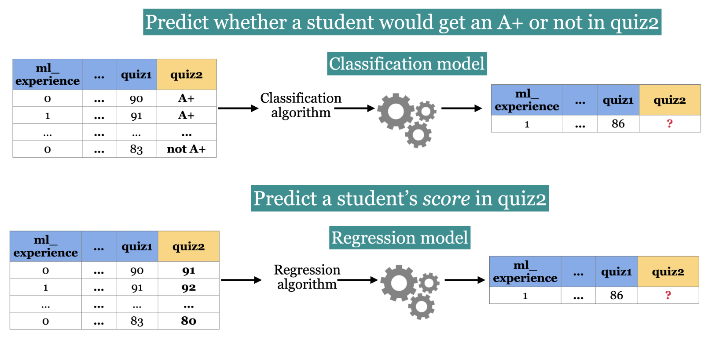
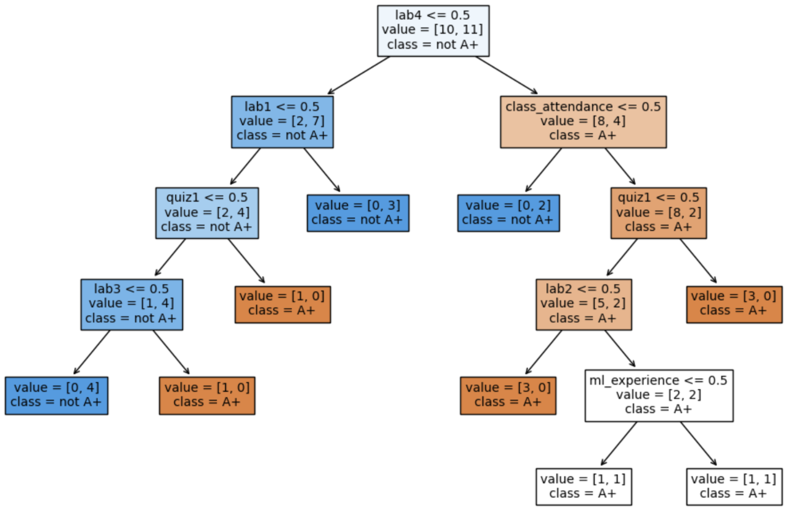
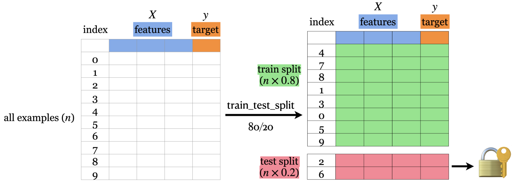
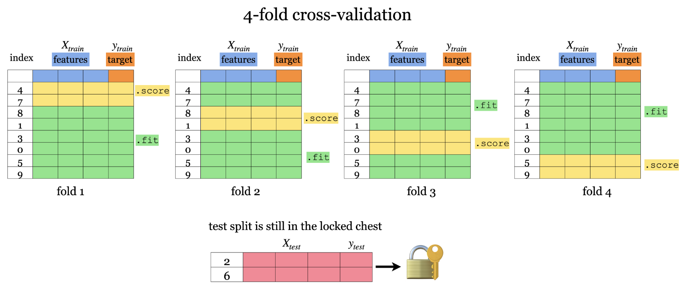
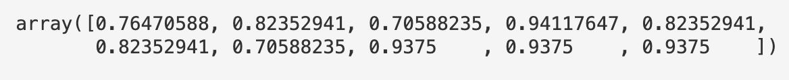
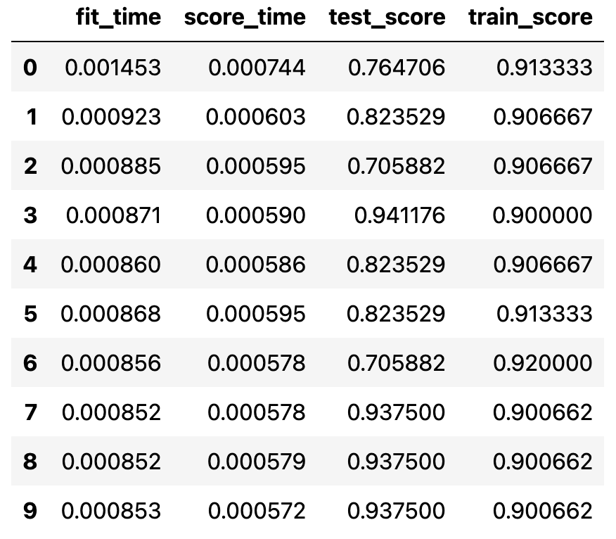

# Supervised Learning 1

Covers fundamental concepts and techniques in supervised machine learning such as data splitting, cross-validation, generalization, overfitting, the fundamental trade-off, the golden rule, and data preprocessing.

Also, explore popular machine learning algorithms, including decision trees, k-nearest neighbors, SVMs, naive Bayes, and linear models, using [the scikit-learn framework](https://scikit-learn.org/stable/).

## 1. Terminologies

+-----------------+-----------+-----------------------------------------+------------------------------------------------------------------------------------------+
| Term            | Notation  | What is it?                             | Also called                                                                              |
+=================+===========+=========================================+==========================================================================================+
| Examples        | n         | each row or observation                 | samples, records, instances                                                              |
+-----------------+-----------+-----------------------------------------+------------------------------------------------------------------------------------------+
| Features        | X         | relevant characteristics of the problem | inputs, predictors, explanatory variables, regressors, independent variables, covariates |
+-----------------+-----------+-----------------------------------------+------------------------------------------------------------------------------------------+
| No. of features | d         | number of features used                 |                                                                                          |
+-----------------+-----------+-----------------------------------------+------------------------------------------------------------------------------------------+
| Target          | y         | feature to be calculated or predicted   | outputs, outcomes, response variables, dependent variable, labels (if categorical)       |
+-----------------+-----------+-----------------------------------------+------------------------------------------------------------------------------------------+
| Training        | f         | process of mapping features to targets  | fitting, learning\                                                                       |
+-----------------+-----------+-----------------------------------------+------------------------------------------------------------------------------------------+

## 2. Problem types

In supervised machine learning, there are two main kinds of learning problems based on what they are trying to predict.

1. **Classification problem**: predicting among two or more discrete classes
    1. Example1: Predict whether a patient has a liver disease or not
    2. Example2: Predict whether a student would get an A+ or not in quiz2.
2. **Regression problem**: predicting a continuous value
    2.  Example1: Predict housing prices
    3.  Example2: Predict a student’s score in quiz2.

{fig-align="center" width="100%"}

## 3. Baselines

A simple machine learning algorithm based on simple rules of thumb.

- For example, most frequent baseline always predicts the most frequent label in the training set.

- Baselines provide a way to sanity check your machine learning model.

#### 3.1 DummyClassifier

- `sklearn`’s baseline model for classification

- It uses the majority class for calculating **accuracy**.

    ```
    from sklearn.dummy import DummyClassifier

    # Create `X` and `y` from the given data
    X = classification_df.drop(columns=["quiz2"])
    y = classification_df["quiz2"]

    # instantiate
    clf = DummyClassifier(strategy="most_frequent")

    # train
    clf.fit(X, y)

    # score
    clf.score(X, y)

    # predict
    new_examples = [[0, 1, 92, 90, 95, 93, 92], [1, 1, 92, 93, 94, 92]]
    clf.predict(new_examples)
    ```

- `score` gives the **accuracy** of the model, i.e., proportion of correctly predicted targets from the total targets.

- `error` is **1 -** **accuracy.**

#### 3.2 DummyRegressor

- `sklearn`’s baseline model for regression

- It uses mean of the y values for calculating accuracy.

<!-- -->

- The `score` method in the context of regression returns somethings called $R^2$ score.

    ```
    from sklearn.dummy import DummyRegressor

    # Create `X` and `y` from the given data
    X = regression_df.drop(columns=["quiz2"])
    y = regression_df["quiz2"]

    # instantiate
    reg = DummyRegressor()

    # train
    reg.fit(X, y)

    # score
    reg.score(X, y)

    # predict
    new_examples = [[0, 1, 92, 90, 95, 93, 92], [1, 1, 92, 93, 94, 92]]
    reg.predict(new_examples)
    ```

## 4. ML model #1 - Decision Trees

A machine learning algorithm to derive rules from data in a principled way.

#### 4.0 Notations

+---------------+------------------------------------------------------------------------------------------------------------------------------+
| Root node     | represents the first condition to check or question to ask                                                                   |
+---------------+------------------------------------------------------------------------------------------------------------------------------+
| Branch        | connects a node (condition) to the next node (condition) in the tree. Each branch typically represents either true or false. |
+---------------+------------------------------------------------------------------------------------------------------------------------------+
| Internal node | represents conditions within the tree                                                                                        |
+---------------+------------------------------------------------------------------------------------------------------------------------------+
| Leaf node     | represents the predicted class/value when the path from root to the leaf node is followed.                                   |
+---------------+------------------------------------------------------------------------------------------------------------------------------+
| Tree depth    | The number of edges on the path from the root node to the farthest away leaf node.                                           |
+---------------+------------------------------------------------------------------------------------------------------------------------------+

#### 4.1 DecisionTreeClassifier

- `sklearn`'s decision tree classifier.

    ```
    from sklearn.tree import DecisionTreeClassifier

    X_binary = X.copy()
    columns = ["lab1", "lab2", "lab3", "lab4", "quiz1"]
    for col in columns:
        X_binary[col] = X_binary[col].apply(lambda x: 1 if x >= 90 else 0)

    # Create a decision tree
    model = DecisionTreeClassifier()

    # train
    model.fit(X_binary, y) 

    # score
    model.score(X_binary, y)

    # predict
    model.predict(X_binary, y)
    ```

    ```
    import matplotlib.pyplot as plt
    from sklearn.tree import plot_tree

    def custom_plot_tree(tree_model, feature_names=None, class_names=None, **kwargs):
        """
        Customizes and displays a tree plot for a scikit-learn Decision Tree Classifier.

        Parameters:
        - tree (sklearn.tree.DecisionTreeClassifier): The trained Decision Tree Classifier to visualize.
        - width: width of the matplotlib plot in inches 
        - height: height of the matplotlib plot in inches 
        - feature_names (list or None): A list of feature names to label the tree nodes with feature names.
                                        If None, generic feature names will be used.
        - class_names (list or None): A list of class names to label the tree nodes with class names.
                                      If None, generic class names will be used.
        - **kwargs: Additional keyword arguments to be passed to the `sklearn.tree.plot_tree` function.

        Returns:
        - None: The function displays the customized tree plot using Matplotlib.

        This function customizes the appearance of a Decision Tree plot generated by the scikit-learn
        `plot_tree` function. It hides both the samples and values in each node of the tree plot
        for improved visualization.
        """    
        plot_tree(tree_model, 
                  feature_names=feature_names, 
                  class_names=class_names, 
                  filled=True, 
                  **kwargs)

        # Customize the appearance of the text elements for each node
        for text in plt.gca().texts:
            new_text = re.sub('samples = \d+\n', '', text.get_text()) # Hide samples
            text.set_text(new_text) 

        plt.show()


    width=12 
    height = 8
    plt.figure(figsize=(width, height))
    custom_plot_tree(model, 
                     feature_names=X_binary.columns.tolist(), 
                     class_names=['A+', 'not A+'],
                     impurity=False,
                     fontsize=10,)
    ```

    {width="500"}

How does fit work?

- Minimize **impurity** at each question

- Common criteria to minimize impurity: [gini index](https://scikit-learn.org/stable/modules/tree.html#classification-criteria), information gain, cross entropy

These are methods used in decision tree algorithms to select the best feature for splitting the data at each node:

1. **Gini Index**: Measures the probability of a randomly chosen element being incorrectly labeled if it was randomly labeled according to the distribution of labels in the subset. Lower values indicate better splits.

2. **Information Gain**: Evaluates how much information about the class is gained by making a split based on a feature. It's calculated using entropy, with higher values indicating more useful splits.

3. **Cross Entropy**: Similar to entropy, it measures the level of uncertainty in the data after a split. Lower cross entropy indicates a more certain or "pure" split.

#### 4.2 DecisionTreeRegressor

- `sklearn`'s decision tree regressor.

    ```
    X = regression_df.drop(["quiz2"], axis=1)
    y = regression_df["quiz2"]

    depth = 2

    reg_model = DecisionTreeRegressor(max_depth=depth)

    reg_model.fit(X, y)

    reg_model.score(X, y)

    reg_model.predict(X)
    ```

**Change in features (e.g., binarizing features) would not change DummyClassifier predictions.** For the decision tree algorithm to work, the feature values must not necessarily be binary. The prediction in a decision tree works by routing the example from the root to the leaf.

#### 4.3 Parameters, hyperparameters and decision boundary

1. **Parameters**
    1. best feature to split on
    2. threshold value for the split
    3. These parameters are learnt by the decision tree algorithm while training
    4. Then used on new examples

Parameters are learned during the training.

A decision tree with only one split is called a decision stump (depth = 1)

2. **Hyperparameters**
    1. Knobs that you set for a model
    2. Controls how training will happen
    3. Set using domain knowledge, automated optimization

Hyperparameters are set before training are based on domain knowledge, optimization etc. e.g., `max_depth`,`min_samples_split`, `min_samples_leaf`, `max_leaf_nodes`

3. **Decision Boundary**
    1. Separation between the classes of the target variable is called a decision boundary.

## 5. Generalization

Given a model in ML, people usually talk about two kinds of errors.

1. Error on the training data

2. Error on the entire distribution of data (we don't have this option since we don't have all the data)

### 5.1 How to approximate generalization error?

A common way is **data splitting**.

- Keep aside some randomly selected portion from the training data.

- `fit` (train) a model on the training portion only.

- `score` (assess) the trained model on this set aside data to get a sense of how well the model would be able to generalize.

- Pretend that the kept aside data is representative of the real distribution of data.

**Simple train/test split**

- The picture shows an 80%-20% split of a toy dataset with 10 examples.

- The data is shuffled before splitting.

- Usually when we do machine learning we split the data before doing anything and put the test data in an imaginary chest lock.



**Some arguments of train_test_split**

`test_size`, `train_size` arguments

- We can specify either of the two. See the documentation [here](https://scikit-learn.org/stable/modules/generated/sklearn.model_selection.train_test_split.html).

- There is no hard and fast rule on what split sizes should we use.

  - It depends upon how much data is available to you.

- Some common splits are 90/10, 80/20, 70/30 (training/test).

- In the above example, we used 80/20 split.

`random_state` argument

- The data is shuffled before splitting which is crucial step.

- The `random_state` argument controls this shuffling.

- In the example above we used `random_state=123`. If you run this notebook with the same `random_state` it should give you exactly the same split.

  - Useful when you want reproducible results.

**Train, validation, test, and deployment data**

We will try to use **"validation"** to refer to data where we have access to the target values.

- But, unlike the training data, we only use this for hyper-parameter tuning and model assessment; we don’t pass these into `fit`.

- Validation data is also referred to as **development data** or **dev set** for short.

We will try to use **"test"** to refer to data where we have access to the target values

- But, unlike training and validation data, we neither use it in training nor hyper-parameter optimization.

- We only use it **once** to evaluate the performance of the best performing model on the validation set.

- We lock it in a “vault” until we’re ready to evaluate.

We will use **"deployment"** data after we deploy our model

- After we build and finalize a model, we deploy it, and then the model deals with the data in the wild.

- We will use “deployment” to refer to this data, where we do **not** have access to the target values.

- Deployment error is what we *really* care about.

- We use validation and test errors as proxies for deployment error, and we hope they are similar.

- So, if our model does well on the validation and test data, we hope it will do well on deployment data.

- Code 80/20 split:

    ```
    from sklearn.model_selection import train_test_split

    X_train, X_test, y_train, y_test = train_test_split(
        X, y, test_size=0.2, random_state=123
    )  
    ```

- or:

    ```
    train_df, test_df = train_test_split(
        df, test_size=0.2, random_state=123
    )  

    X_train, y_train = train_df.drop(columns=["country"]), train_df["country"]
    X_test, y_test = test_df.drop(columns=["country"]), test_df["country"]
    ```

## 6. Cross-validation

### 6.1 Why do we do it?

- We are using only a portion of the data for training and another portion for validation.

- If your dataset is small you might end up with a tiny training and/or validation set.

- You might be unlucky with your splits such that they don’t align well or don’t well represent your test data.

- Cross validation splits the data into k folds

- Each fold gets to become the validation set

- cross-validation doesn’t shuffle the data; it’s done in `train_test_split`.

- Each fold gives a score and we usually average our k results.

- It’s better to examine the variation in the scores across folds.

- Gives a more **robust** measure of error on unseen data.



```
from sklearn.model_selection import cross_val_score, cross_validate
```

### 6.2 `cross_val_score`

```
model = DecisionTreeClassifier(max_depth=4)
cv_scores = cross_val_score(model, X_train, y_train, cv=10)

print(f"Average cross-validation score = {np.mean(cv_scores):.2f}")
print(f"Standard deviation of cross-validation score = {np.std(cv_scores):.2f}")
```

- It creates `cv` folds on the data.

- In each fold, it fits the model on the training portion and scores on the validation portion.

- The output is a list of validation scores in each fold.

{fig-align="center" width="577"}

### 6.3 `cross_validate`

```
scores = cross_validate(model, X_train, y_train, cv=10, return_train_score=True)
pd.DataFrame(scores)

pd.DataFrame(pd.DataFrame(scores).mean())
```

- Similar to `cross_val_score` but more powerful.

- Gives us access to training and validation scores.

{fig-align="center" width="350"}

**Keep in mind that cross-validation does not return a model. It is not a way to build a model that can be applied to new data. The purpose of cross-validation is to evaluate how well the model will generalize to unseen data.**

Note that both `cross_val_score` and `cross_validate` functions do not shuffle the data. Check out [**`StratifiedKFold`**](https://scikit-learn.org/stable/modules/generated/sklearn.model_selection.StratifiedKFold.html#sklearn.model_selection.StratifiedKFold), where proportions of classes is the same in each fold as they are in the whole dataset. By default, `sklearn` uses `StratifiedKFold` when carrying out cross-validation for classification problems.

### 6.4 Incorporating cross validation in training and testing

- We are given training data with features `X` and target `y`

- We split the data into train and test portions: `X_train, y_train, X_test, y_test`

- We carry out hyper-parameter optimization using cross-validation on the train portion: `X_train` and `y_train`.

- We assess our best performing model on the test portion: `X_test` and `y_test`.

- What we care about is the **test error**, which tells us how well our model can be generalized.

- If this test error is “reasonable” we deploy the model which will be used on new unseen examples.

```
X_train, X_test, y_train, y_test = train_test_split(X, y, random_state=42)
model = DecisionTreeClassifier(max_depth=10)
scores = cross_validate(model, X_train, y_train, cv=10, return_train_score=True)
pd.DataFrame(scores)
```

## 7. Underfitting, Overfitting, Fundamental Trade-Off, and the Golden Rule

Imagine that your train and validation errors do not align with each other. How do you diagnose the problem?

We’re going to think about 4 types of errors:

- Etrain is your training error (or mean train error from cross-validation).

- Evalid is your validation error (or mean validation error from cross-validation).

- Etest is your test error.

- Ebest is the best possible error you could get for a given problem.

#### Underfitting
